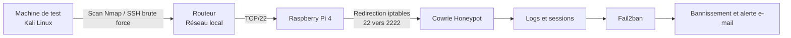

# honeypot-ssh-cowrie-raspberry-pi
Déploiement d’un honeypot SSH Cowrie sur Raspberry Pi 4 pour détecter, analyser et bloquer les tentatives d’intrusion.
# Honeypot SSH avec Cowrie sur Raspberry Pi 4


## Présentation

Ce projet présente l'implémentation d'un honeypot SSH avec **Cowrie** sur un **Raspberry Pi 4** afin de détecter, enregistrer et analyser des tentatives d'intrusion dans un environnement contrôlé.

Cowrie simule un système UNIX accessible en SSH. Il conserve les tentatives d'authentification, les sessions ouvertes et les commandes saisies dans le faux terminal sans donner accès au système réel. Une intégration avec **Fail2ban** complète le dispositif en bloquant automatiquement les adresses IP suspectes et en générant une alerte par e-mail.

> Ce laboratoire a été réalisé uniquement à des fins pédagogiques, dans un environnement contrôlé et avec des systèmes autorisés.

---

## Objectifs

- Déployer un honeypot SSH sur un équipement physique à faible consommation.
- Simuler un service SSH réaliste avec Cowrie.
- Rediriger les connexions du port 22 vers le port d'écoute de Cowrie.
- Collecter les tentatives d'authentification et les commandes exécutées.
- Simuler un scan réseau et une attaque par force brute.
- Analyser les journaux générés par le honeypot.
- Bloquer les sources suspectes avec Fail2ban.
- Envoyer une notification lors du bannissement d'une adresse IP.

---

## Architecture du laboratoire

Le Raspberry Pi héberge Cowrie sous un compte non privilégié. Les connexions reçues sur le port SSH standard sont redirigées vers le port 2222 utilisé par le honeypot.




### Composants

| Composant | Rôle |
|---|---|
| Raspberry Pi 4 | Hébergement du honeypot |
| Raspberry Pi OS | Système d'exploitation |
| Cowrie | Simulation du service SSH et collecte des interactions |
| iptables | Redirection du port 22 vers le port 2222 |
| Fail2ban | Détection et bannissement des sources suspectes |
| Postfix / Mailutils | Envoi des notifications par e-mail |
| Kali Linux | Génération des tests Nmap et Hydra |


---

## Déploiement de Cowrie

### 1. Préparation du système

Le Raspberry Pi OS est installé sur une carte microSD. Les services SSH et VNC sont ensuite activés pour permettre l'administration distante du Raspberry Pi.

### 2. Installation des dépendances

```bash
sudo apt update
sudo apt upgrade
sudo apt install git python3-venv libssl-dev libffi-dev \
  build-essential libpython3-dev python3-minimal authbind
```

### 3. Création d'un compte dédié

Cowrie est exécuté depuis un compte non-root afin de limiter les privilèges du service.

```bash
sudo adduser --disabled-password cowrie-user
sudo su - cowrie-user
```

### 4. Installation de Cowrie

```bash
git clone https://github.com/cowrie/cowrie.git
cd cowrie
python3 -m venv cowrie-env
source cowrie-env/bin/activate
python3 -m pip install --upgrade pip
python3 -m pip install --upgrade -r requirements.txt
```


---

## Configuration du honeypot

Le fichier de configuration est créé à partir du modèle fourni par Cowrie :

```bash
cp etc/cowrie.cfg.dist etc/cowrie.cfg
nano etc/cowrie.cfg
```

Principaux paramètres utilisés :

```ini
[honeypot]
hostname = Lmhaj

[ssh]
enabled = true
listen_port = 2222
```


### Redirection du port SSH

Le trafic arrivant sur le port 22 est redirigé vers le port 2222 :

```bash
sudo iptables -t nat -A PREROUTING -p tcp --dport 22 \
  -j REDIRECT --to-port 2222
sudo apt install iptables-persistent
```

### Démarrage et supervision

```bash
bin/cowrie start
tail -f var/log/cowrie.log
```

---

## Scénarios de validation

### Scénario 1 - Découverte avec Nmap

Un scan est exécuté depuis une machine Kali Linux afin d'identifier le service SSH exposé par le Raspberry Pi :

```bash
sudo nmap -A -sV -vv -T4 192.168.1.174
```

Le test permet de vérifier que le service SSH simulé est accessible et détectable depuis la machine de test.

### Scénario 2 - Simulation d'une attaque par force brute

Hydra est utilisé dans le laboratoire pour générer plusieurs tentatives d'authentification SSH :

```bash
sudo hydra -l test-user -P /usr/share/wordlists/rockyou.txt \
  ssh://192.168.1.174
```

Cowrie enregistre notamment :

- l'adresse IP source ;
- le nom d'utilisateur et le mot de passe testés ;
- le résultat de l'authentification ;
- l'ouverture et la fermeture de la session ;
- les commandes saisies dans le faux terminal ;
- la date et l'heure de chaque événement.

### Scénario 3 - Observation d'une session Cowrie

Après la connexion au faux service SSH, l'utilisateur obtient un shell UNIX simulé. Les commandes saisies sont enregistrées dans les journaux Cowrie sans être exécutées sur le Raspberry Pi réel.


---

## Intégration de Fail2ban

Fail2ban est ajouté pour apporter une capacité de réponse active après plusieurs échecs d'authentification.

```bash
sudo apt install fail2ban mailutils postfix
```

Exemple de configuration de la jail Cowrie :

```ini
[cowrie]
enabled = true
port = 2222
filter = cowrie
logpath = /home/cowrie-user/cowrie/var/log/cowrie.log
maxretry = 3
findtime = 600
bantime = 3600
```

Après trois tentatives échouées, l'adresse IP est bannie pendant une heure et une notification est envoyée.


---

## Résultats

| Test | Observation | Résultat |
|---|---|---|
| Scan Nmap | Détection du service SSH exposé | Validé |
| Brute force Hydra | Collecte des identifiants testés et des connexions | Validé |
| Session SSH simulée | Enregistrement des commandes saisies | Validé |
| Analyse des logs | Événements Cowrie consultables en temps réel | Validé |
| Fail2ban | Bannissement après trois tentatives échouées | Validé |
| Notification | Réception d'une alerte de bannissement | Validé |

Le projet valide la chaîne suivante :

```text
Connexion suspecte -> Interaction simulée -> Journalisation
-> Analyse -> Bannissement -> Notification
```

---

## Compétences développées

- Déploiement d'un honeypot SSH avec Cowrie.
- Administration de Raspberry Pi OS et Linux.
- Sécurisation d'un service avec un compte non-root.
- Gestion d'un environnement virtuel Python.
- Configuration réseau et redirection de ports avec iptables.
- Analyse des tentatives d'authentification SSH.
- Collecte et interprétation de journaux de sécurité.
- Simulation contrôlée de scans et d'attaques par force brute.
- Configuration de Fail2ban et de règles de bannissement.
- Mise en place de notifications de sécurité par e-mail.

---

## Sécurité et utilisation responsable

Ce projet est destiné à l'apprentissage de la cybersécurité défensive. Les tests doivent uniquement être exécutés sur des équipements appartenant à l'utilisateur ou pour lesquels une autorisation explicite a été obtenue.

Les adresses IP utilisées appartiennent au réseau privé du laboratoire. Aucun mot de passe réel, secret ou élément d'une infrastructure de production n'est publié.

---

## Auteure

Projet académique réalisé par **Maryeme Aftyss**

**Maryeme Aftyss**  
Ingénieure d'État en cybersécurité  

[Consulter mon profil GitHub](https://github.com/MaryemeAftyss)
